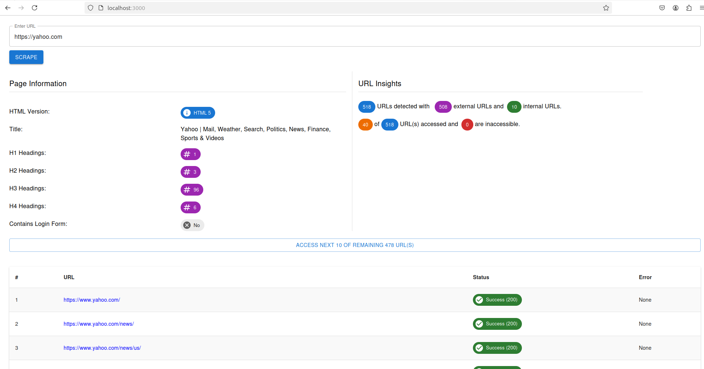

# Scraper client

## How to run using Docker

* Run `docker-compose up --build`

## How to access

* Open `localhost:3000` on browser.
* Enter the URL to scrape and press `SCRAPE` button.
* You should see the scrapped summary as below screenshot.
* We only check the accessbility of 10 URLs at a time to make it possible to handle any number of URLs checks.
* You may click `ACCESS NEXT ..` button to check accessbility of remaining URLs.

